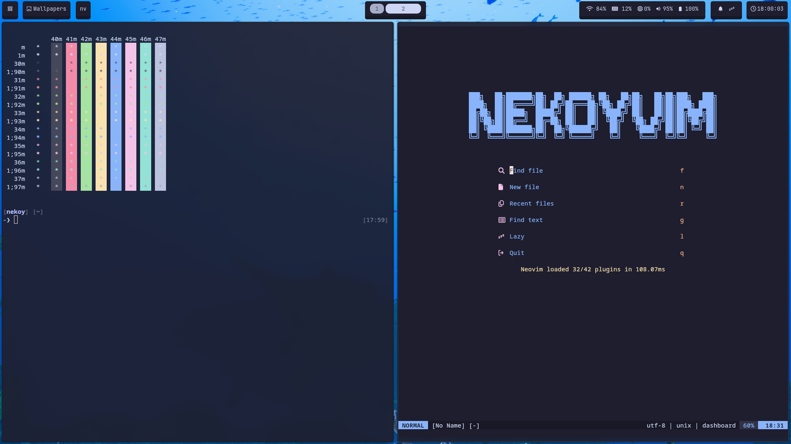

<p align="center">
  <a href="https://github.com/1Nekoy2/.nekoysdotfiles/">
    
  </a>
</p>

<p align="center">
  <a href="#about">About</a> |
  <a href="#installation">Installation</a> |
  <a href="#Source">Source</a>
</p>

## About



This repository contains my dotfiles for my Arch system

> [!NOTE]
> This repository is a work in progress, and I will be updating it as I make changes to my system.

- Linux Distribution : Arch Linux
- Window Manager : [Hyprland](https://github.com/hyprwm/Hyprland)
- Bar : [Waybar](https://github.com/Alexays/Waybar)
- Terminal Emulator : [Kitty](https://sw.kovidgoyal.net/kitty/)
- launcher : Rofi
- Shell : [Zsh](https://www.zsh.org/)
- Editor : [Neovim](https://neovim.io/)
- File Manager : [Thunar](https://docs.xfce.org/xfce/thunar/start)
- CLI System Monitor : [fastfetch](https://github.com/fastfetch-cli/fastfetch)

## Installation

> [!CAUTION]
> Settings applied by this repository are personal, and definitely not suite everyones needs. Don’t blindly use my settings unless you know what that entails. Use at your own risk!

### Arch Requirements

Ensure you have the following installed on your system

```bash
sudo pacman -S git paru rustup zsh stow
```

---

### Instal the dotfiles

```bash
git clone --recurse-submodules https://github.com/1Nekoy2/.nekoysdotfiles.git ~/.nekoysdotfiles && cd ~/.nekoysdotfiles
```

then use GNU stow to create symlinks

```bash
stow .
```

Start zsh to load environmental variables

```bash
zsh
```

now install default rust envirament with

```bash
rustup default stable
```

install rebos

```bash
cargo install rebos
```

run rebos setup

```bash
rebos setup
```

now commit changes

```bash
rebc "initial"
```

or

```bash
rebos gen commit "initial"
```

install all other needed packages

```bash
rebb
```

or

```bash
rebos gen current build
```

## Source

[stow](https://www.youtube.com/watch?v=y6XCebnB9gs&t) <br />
[rebos](https://www.youtube.com/watch?v=QCrRT-ZjwVQ&t)
